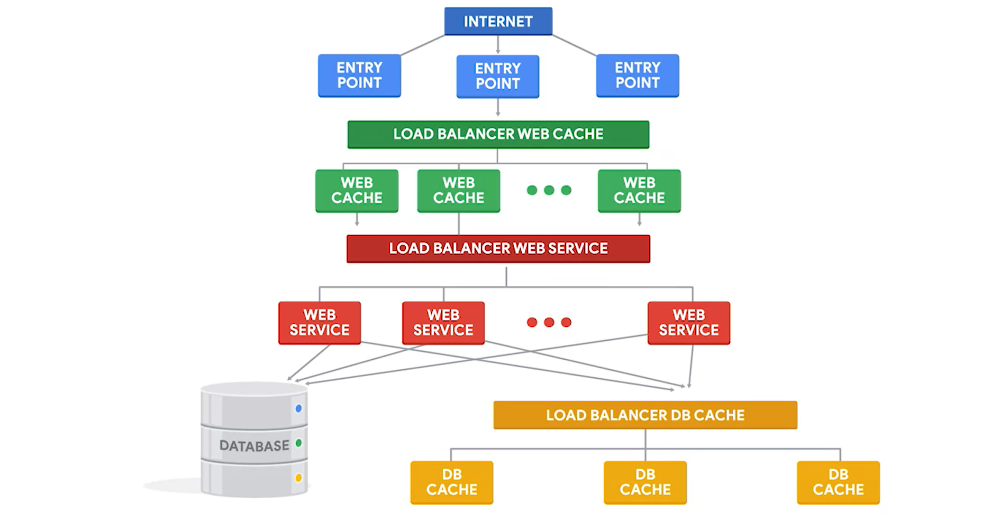

## Cloud Scale Deployments 

A bunch of different instances? use load balancer.

`Load Balancer` : Ensures that each node receives a balanced number of requests.

There are many ways load balancer uses to selec node :
- Simplest one, give each node one request called `Round Robin`
- More complex include : 
    - always selecting the same node for requests coming from the same origin, 
    - selecting node that's closest to the reequest, and 
    - selecting the one with the least current load.

Instances group like this spin up node when full request, and shut down when demand falls.

`Auto Scaling` : `Service` increase or reduce capacity as `needed` while the `service owner` only pays for the `cost` of the machines that are in use at any `given time`

The data in the node that gets deleted is sohrt-lived. Need data persistence? create separate storage.

`Cloudflare`/`Fastly` : Web caching as a server

Architechture for large application where speed and availability matter :

The most popular app for this level of caching are `Memcached` and `Redis`

 

## Orchestration 

`orchestration` : The automated configuration and coordination of complex IT systems and services. orchestration means automating a lot of different things that need to talk to each other

Will generally involve configuring a bunch of different systems

Ex of orchestration tools : Terraform, CloudFormation, Azure Resource Manager.

Say you wanted to deploy a `new` copy of the system in a `separate` `data center` where you have `no` `instances` yet, you'll need to also automate the whole configuration of the system, the different instance types involved, how will each instance finesse the others, what the internal network looks like, and so on.

The key here is that the configuration of the overall system needs to be automatically repeatable

`Cloud provider APIs` : Let you handle the configuration that you want to sit directly from your scripts or programs without having to call a separate command

By using orchestration tools, we can automate the configuration of any monitoring rules that we need to set, which metrics we want to look for, when we want to be alerted, and so on, and automatically apply these to a complete deployment no matter which datacenter the services are running in.

 

## Cloud Infrastructure as Code 

`Terraform` : DSL, spesify what we want our Cloud infrastructure to look like. The cool thing is it knows how to interact with a lot of `different` cloud `providers` and `vendors`.

`Terraform` uses each Cloud provider's `API` to accomplish this. This keeps you from having to learn a new API when moving to a different Cloud provider

`Puppet` also have plug-ins to interact with different cloud providers.

### Talking about nodes (instances) managed by the Orchestration tools
`Long-lived` instances are typically servers that are not expected to go away

`short-lived` instances come and go very quickly. Makes no sense if we apply config while its running (instead apply when start)

 

### More about Cloud and Google Cloud Provider
<ul><li>
<a href="https://cloud.google.com/community/tutorials/getting-started-on-gcp-with-terraform" title="" target="_blank" rel="noopener nofollow" aria-label=""><em><u>Getting started on GCP with Terraform</u></em></a>
</li>
<li>
<a href="https://cloud.google.com/compute/docs/instance-groups/creating-groups-of-unmanaged-instances" title="" target="_blank" rel="noopener nofollow" aria-label=""><em><u>Creating groups of unmanaged instances</u></em></a>
</li><li>
Official documentation is here: <a href="https://cloud.google.com/load-balancing/docs/https/" title="" target="_blank" rel="noopener nofollow" aria-label=""><u>https://cloud.google.com/load-balancing/docs/https/</u></a>
</li><li>
<a href="https://geekflare.com/gcp-load-balancer/" title="" target="_blank" rel="noopener nofollow" aria-label=""><u>https://geekflare.com/gcp-load-balancer/</u></a>
</li></ul>

Interesting articles about hybrid setups :
<ul><li>
<a href="https://blog.inkubate.io/create-a-centos-7-terraform-template-for-vmware-vsphere/" title="" target="_blank" rel="noopener nofollow" aria-label=""><u>https://blog.inkubate.io/create-a-centos-7-terraform-template-for-vmware-vsphere/</u></a>
</li><li>
<a href="https://www.terraform.io/docs/enterprise/before-installing/reference-architecture/gcp.html" title="" target="_blank" rel="noopener nofollow" aria-label=""><u>https://www.terraform.io/docs/enterprise/before-installing/reference-architecture/gcp.html</u></a>
</li><li>
<a href="https://www.hashicorp.com/resources/terraform-on-premises-hybrid-cloud-wayfair" title="" target="_blank" rel="noopener nofollow" aria-label=""><u>https://www.hashicorp.com/resources/terraform-on-premises-hybrid-cloud-wayfair</u></a>
</li></ul>

