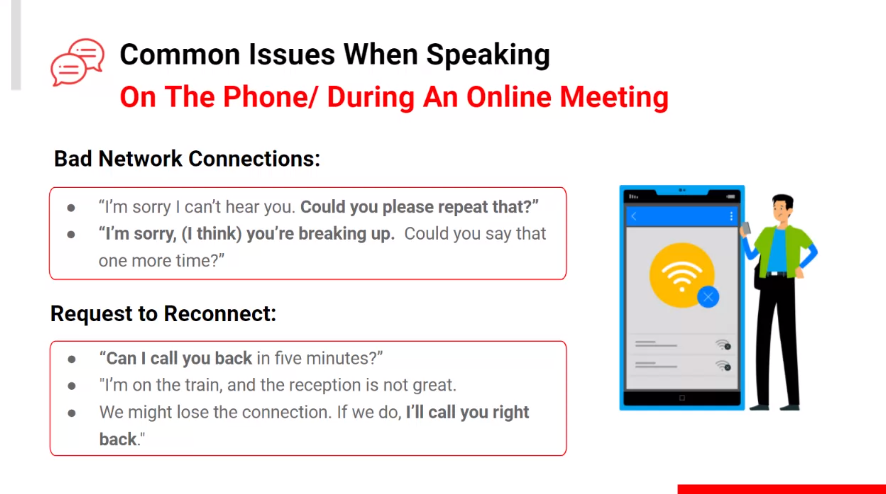

## ILT-ENG 

Welcome! Philip Reyes will teach us today.

### Listening 2 minute phone conversation
Business Rpresentative and Customer

Ted Marshall (Man),
Maria Saharini (Girl).

Girl : Problem with printer, model is PX-120, I only bought it for 6 month. WE bought 3 identical printer. The problem it works, I think not the part has gone wrong, the speed and quality is not good or as fast.

Man : Arrange time for service engineer. Appointment,, next wednesday the fifth

Girl : tomorrow maybe?

Man : no, because the service engineer is sick. Next wednesday is the earliest.

Man : First appoinment at 8

Girl : okay, thanks bye

### The Flow and Key Phrases
- Making the call
    - Picking up the call
- Greeting and Introduction
- Verifying the receiver
    - Yes/No, 
    - Asking the caller's purpose
- Telling the purpose of calling
    - Responding to caller's purpose
- Ending The Call (Thanks for calling, Have a good evening)

 

## Asking Questions 

Begin with a question :
- How may I helo you [name]?
- What can I do to helo you with this project?

5W1H Formula examples :  

- What is you additional request?
- Who is involved in the programming team?
- When is the due date of assignments?
- Where do you want to set up the meeting?
- Why is the project postponed?
- How will you design the layour of the website?
- How many hours do you need to build this feature?

## Clarity 

Make sure the information is Correct. 
"Could you please clarify ...", "If I understood you correctly, what do you mean by.."

 

## Follow Up : Make or Break the Relationship 

"I would like to follow up our conversation about ... Any ideas?",  
"I will keep you in the loop and send you an email every time I receive an update".

 

## Permission, Reqeust, And Offers 

`modal verbs` : Make our request or question to show respect and politeness.  
Instead of "Do you mind". "Will you allow me to", use modal verbs to make it shorter.

| Type | Modal Verbs |
| - | - |
| Ability | Can, Could |
| Permission | Can, Could, May |
| Advice | Should |
| Obligation |  Must, Have To |
| Possibility | Might, May, Could, Can |

Could you please fill the asignment? It is better right?

Could better than can. May mainly ask for permission.  
Can I go to the bathroom? Yes you can, but you not may, you can walk there, but you aren't allowed!

| Type | Modal Verb : Can |
| - | - |
| Abiliy | Can you submit the project in 24 hours? |
| Permission | Can I use your idea for the project? |
| Possibility | Can I submit the project next week? |

### Practice : Make better sentences
| Before | After |
| - | - |
| Delete this product from the database | `Could` you remove this product database? |
| Revise it and send it to me by spesific deadline | `Could` you revise it and send it to me by a spesific deadline |
| Add new feature to access our user's data | `Could` you add new feature to access our user's data |
| I use this plugin to gain insight about website visitors | `May` I use this plugin to gain insight about website visitors? |
| Use your charger | `May`/`Could` I use your charger? |

## Accept/Rejecting a Request 

Accepting a Request 
A : "Can you please ..." 
B : "Sure, that's not a problem"

Declining a Request 
A: "Can you ..." 
B : "I'm sorry, but I don't think I can do that. It is supposed to be [state your reasons]"

 

## Online Meeting Conversation 

- Establish Ground Rules
- Allocate Roles

### Conversation During Meeting
Agreeing to a  descision : 
A : "Tahis feature is no longer needed..." 
B : "I'am with you. Our costumer never use that anyway, do you want to remove it now?" 

Deffering a decision :  
A : "Due to budget constraints, we decided to reduce manpower for this project" 
B : "I understand your consideration, but can you please me some time with my team to discuss?"

### Giving Follow Up
You also need to do follow up

### Giving Negative Information

### Common Issue When Speaking

 

## Practice 

Reggy : Hello, is this Tria from ABC software development agency?\
Tria : Yes this is Tria. To whom I am speaking with?\
Reggy : Hi, my name is Reggy. I got your number from my friend at yesterday's networking event.\
Tria : Hi Reggy, I remember you! You did an amazing presentation yesterday. What can I help you with?\
Reggy : From which I remember, you are a web developer in your company. I want to build an interactive e-commerce website, could you help me?\
Tria : Sure, that's no problem. Our agency offers several service packages for websites. interactive e-commerce website starts at [lag] and change [lag] your need, what [lag] ?\
Reggy : Sorry but it appears that there's a network issue that causes your voice to be distrupted. Could we arrange a meeting instead?\
Tria : Sure, what about next week on the 17th of March at New Avanue Cafe?\
Reggy : I'm sorry but I'm not available on that date. What about the day after?\
Tria : No problem, 18th March at 06:00 pm?\
Reggy : Sounds great! Thank you Tria, I'll see you later this week.\
Tria : I'm happy to help.\

Before midnight.
https://links.bangkit.academy/EnglishQuiz_1